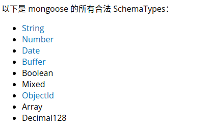

# mongoose的使用

## 1.安装

创建node.js项目后，安装mongoose:npm install mongoose

要求已经安装并打开了mongodb数据库服务器。

## 2.使用流程

1）引入mongoose:

const mongoose = require('mongoose');

2)连接数据库：

mongoose.connect('mongodb://localhost/test');

其中test是数据库名。

3）创建一个schema:

const schema={

​    name:String,

​    age:Number,

​    health:String

}

创建的schema只有在创建model时引用才可以起作用：mongoose.model('Cat',schema);

mongoose有自己的数据类型定义：

创建的schema生效后，存储到数据库的数据必须遵守，否则不能存储，但系统没有原生的错误提示只是存储一个空数据。

4）创建一个model:

const Cat =mongoose.model('Cat',schema);

5）写入数据库：

kitty.save()

写入后数据集的名称：是定义model的第一个参数，并进行了修改：保证是英文的复数形式（如果没有的话，自动在后面加s），不区分大小写，全部用小写字母。

6）数据查询

model名.find({查询条件}，callback(err,查询结果)=>{})

查询结果是一个Array.data[0]._doc是查询出的文档